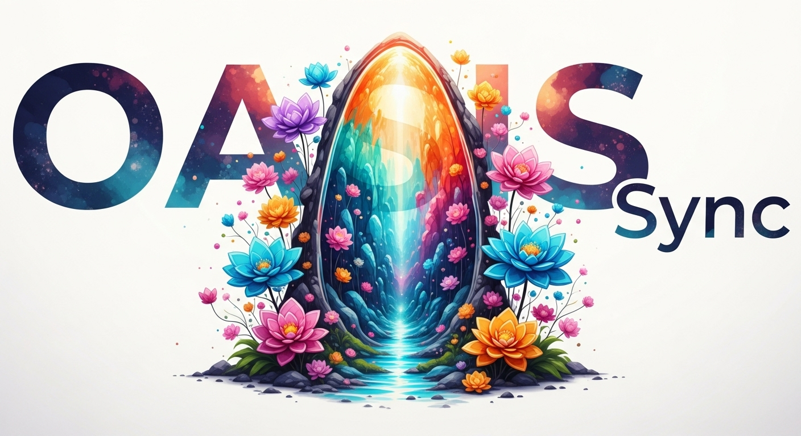

<h1 align="center">🪄 Oasis Article Sync</h1>

<p align="center">
  
</p>

<p align="center">
  <a href="https://github.com/Sunwood-ai-labs/oasis-sync/actions/workflows/oasis-sync.yml">
    
  </a>
  <a href="https://github.com/Sunwood-ai-labs/oasis-sync/actions/workflows/oasis-zenn-sync.yml">
    
  </a>
  <a href="https://github.com/Sunwood-ai-labs/oasis-sync/actions/workflows/oasis-qiita-sync.yml">
    
  </a>
</p>

<p align="center">
  
  
  
  
  
</p>

<p align="center">
  Oasis 配下の記事を検知して Gemini と連携し、Zenn/Qiita 用メタデータの生成から投稿リポジトリへの同期までを自動化します。
</p>

## ✨ Overview

- GitHub Actions で `articles/oasis/` に追加された Markdown を監視し、ハイブリッド front matter を生成します。
- 生成されたメタデータを基に Zenn・Qiita 向け記事を分岐させ、対象リポジトリへ PR/Commit を自動作成します。
- Gemini CLI を利用してタイトルやタグ候補を推論し、レビュー可能な YAML として取り扱います。
- リポジトリをテンプレートとして提供し、最小構成でコンテンツのマルチ配信を始められます。

## 🧱 Architecture

- ワークフロー全体像とジョブ詳細は [`.github/workflows/architecture.md`](./.github/workflows/architecture.md) を参照してください。
- `docs/flow.dio` には GitHub Actions と外部サービスの連携を表すダイアグラムが含まれています。

## 🚀 Setup

1. **テンプレートからリポジトリを作成**  
   `Use this template` をクリックし、自身の GitHub アカウントへコピーします。
2. **環境変数の準備**  
   `.env.example` と `.env.actions.example` を参考に、GitHub Actions 用の `GH_PAT` を Secrets/Variables に設定します。
3. **記事ディレクトリの初期化**
   `articles/oasis/` に元記事を配置します。既存記事には `zenn` / `qiita` セクション付き front matter を付与してください。

## 📦 Usage

1. `articles/oasis/` に Markdown を追加または更新します。
2. `main` ブランチへ push すると、`🪄 Oasis Article Sync` ワークフローが起動します。
3. Gemini が front matter を生成し、Zenn/Qiita への派生 Markdown を `articles/zenn/`, `articles/qiita/` に出力します。
4. `.github/scripts/sync_platform.sh` が各配信先リポジトリへ同期します。
5. ワークフロー結果やログは Actions タブで確認してください。

## 🔄 Workflows

| Workflow | Trigger | Purpose |
| --- | --- | --- |
| `oasis-sync.yml` | push to `articles/oasis/**` / manual | Oasis 記事から Gemini メタデータを生成し、Zenn/Qiita へ分配 |
| `oasis-zenn-sync.yml` | schedule / manual | Zenn 用派生記事を別リポジトリへ同期 |
| `oasis-qiita-sync.yml` | schedule / manual | Qiita 用派生記事を別リポジトリへ同期 |

詳細は各ワークフロー YAML と [Architecture ドキュメント](./.github/workflows/architecture.md) を参照してください。

## 🗂 Repository Layout

```bash
articles/
  oasis/   # ソース記事 (Gemini でメタデータ生成)
  zenn/    # Zenn 用派生記事
  qiita/   # Qiita 用派生記事
.github/
  workflows/  # Actions 定義
  scripts/    # メタデータ生成・同期スクリプト
  prompts/    # Gemini CLI 用プロンプト
docs/
  flow.dio    # アーキテクチャ図 (tldraw 形式)
```

## 📝 Sample Articles

- [Zenn: moondream-3-five-truths](./articles/zenn/moondream-3-five-truths.md)
- [Qiita: moondream-3-five-truths](./articles/qiita/moondream-3-five-truths.md)

## 📚 Related Docs

- [Workflow architecture](./.github/workflows/architecture.md)
- [Gemini CLI reviewer prompts](./.github/prompts/)
- [Sync scripts](./.github/scripts/)

## 🛠 Troubleshooting

- **同期対象のリポジトリにアクセスできない**: `TARGET_REPOSITORY`, `SYNC_TOKEN` など環境変数の設定を確認してください。
- **Gemini 生成がスキップされる**: 既存 front matter に `zenn:` と `qiita:` が含まれている場合、再生成は行われません。
- **`TARGET_PATH` 未設定エラー**: `sync_platform.sh` をローカル実行する際は `TARGET_PATH` を空文字でエクスポートするか、環境変数を指定してください。

---
Generated by Gemini CLI ギャルエンジニア 🎀
