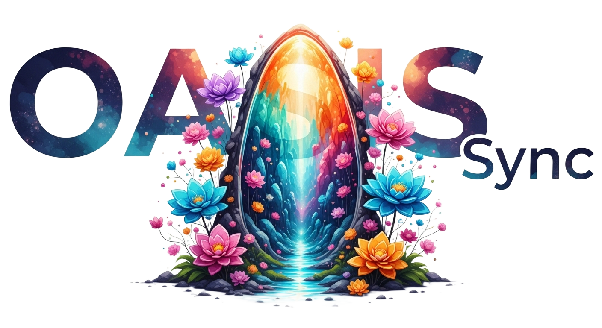

<p align="center">
  
</p>

<h1 align="center">🪄 Oasis Sync</h1>


<p align="center">
  <a href="https://github.com/Sunwood-ai-labs/oasis-sync/actions/workflows/oasis-sync.yml">
    
  </a>
  <a href="https://github.com/Sunwood-ai-labs/oasis-sync/actions/workflows/oasis-zenn-sync.yml">
    
  </a>
  <a href="https://github.com/Sunwood-ai-labs/oasis-sync/actions/workflows/oasis-qiita-sync.yml">
    
  </a>
  <a href="https://github.com/Sunwood-ai-labs/oasis-sync/actions/workflows/oasis-qiita-sync.yml">
    
  </a>
</p>

<p align="center">
  
  
  
  
  
</p>

<p align="center">
  Oasis 配下の記事を検知して Gemini と連携し、Zenn/Qiita 用メタデータの生成から投稿リポジトリへの同期までを自動化します。
</p>

## ✨ Features

- Oasis ハイブリッド記事を検出し、Gemini でメタデータを生成して Zenn/Qiita/WordPress へ安全に分岐。
- Issues ベースの受付ワークフローで、記事・サムネイル素材を自動生成＆コミット。
- リリースタグからヘッダー画像・リリースノート・派生記事までを一気通貫で生成する Gemini Actions Labs。
- Google Gemini/Imagen、Qiita CLI、Git it Write など外部サービスと連携した配信・自動投稿。
- 充実したプロンプトとスクリプト群により、レビューコメントやHugging Face Space の整備まで自動化。

## 🔁 Automation Modules

- **Gemini Actions Labs**  
  リリースタグをトリガーにヘッダー画像を Imagen で生成し、Gemini でリリースノート/ハイブリッド記事を作成。PR レビューの自動化や Hugging Face Space の準備など AI アシストタスクを包含します。
- **Oasis Sync**  
  Oasis ソース記事や Issue 入力を取り込み、Zenn/Qiita/WordPress 形式へ展開。ターゲットリポジトリとの同期や Qiita CLI 連携までを GitHub Actions で完結させます。

設計図と詳細は [`.github/workflows/architecture.md`](./.github/workflows/architecture.md) および [`.github/workflows/architecture.svg`](./.github/workflows/architecture.svg) を参照してください。

## 🧱 Required Secrets & Variables

| 名前 | 種別 | 用途 |
|------|------|------|
| `GH_PAT` | Secret | Actions からの push・Issue 操作全般。 |
| `GEMINI_API_KEY` | Secret | Gemini CLI / Imagen 連携。 |
| `QIITA_TOKEN` | Secret | `qiita/publish.yml` での Qiita CLI 認証。 |
| `HUGGINGFACE_TOKEN` | Secret | Hugging Face Space デプロイ (必要時)。 |
| `vars.GCP_*` 系 | Variable | Google Cloud Workload Identity / Vertex AI 設定。 |
| `vars.*_TARGET_REPOSITORY` など | Variable | 各プラットフォーム同期先のリポジトリ・ブランチ設定。 |

> 追加のラベル管理用トークン（例: `GH_PAT_KOZAKI` など）は PR レビューボットごとに設定してください。

## 🚀 Setup

1. **テンプレートからリポジトリを作成**  
   `Use this template` をクリックし、自身の GitHub アカウントへコピーします。
2. **環境変数の準備**  
   上記「Required Secrets & Variables」に従って Secrets / Variables を登録します。
3. **記事ディレクトリの初期化**  
   `articles/oasis/` にサンプル記事を用意します。既存記事に front matter が含まれる場合は Gemini による再生成がスキップされます。
4. **Issue テンプレートの確認**  
   `.github/ISSUE_TEMPLATE/` のフォームを利用すると、記事・サムネイルが自動生成されます。必要に応じて説明文をカスタマイズしてください。

## 📦 Usage

1. `articles/oasis/` に Markdown を追加または更新します。
2. `main` ブランチへ push すると、`🪄 Oasis Article Sync` ワークフローが起動します。
3. Gemini が front matter を生成し、Zenn/Qiita/WordPress への派生 Markdown を `articles/zenn/`, `articles/qiita/`, `articles/wordpress/` に出力します。
4. `.github/scripts/sync_platform.sh` が各配信先リポジトリへ同期します。
5. ワークフロー結果やログは Actions タブで確認してください。

## 🔄 Workflows

- Oasis 記事を分岐させる入口は `oasis-sync.yml` で、生成処理は `.github/scripts/process_oasis_articles.py` に実装されています。
- 各プラットフォーム向け同期 (`oasis-zenn-sync.yml`, `oasis-qiita-sync.yml`, `oasis-wordpress-sync.yml`) は共通シェルスクリプトでターゲットリポジトリに反映します。
- リリースノートと派生記事を扱う `gemini-release-*.yml` 系は Gemini Actions Labs モジュールとしてまとめています。
- トリガー条件やジョブ構成、生成物の詳細は [Architecture ドキュメント](./.github/workflows/architecture.md) を確認してください。

### Workflow Map

| Workflow | モジュール | トリガー | 概要 |
|----------|------------|----------|------|
| `🗂️ Oasis Issue Intake` | Oasis Sync | Issue (label/title) | Issue form から Oasis 記事・画像を生成し commit。 |
| `🪄 Oasis Article Sync` | Oasis Sync | Push / Dispatch | Oasis 記事を検出し Zenn/Qiita/WordPress へ分岐。 |
| `🪄 Oasis Zenn/Qiita/WordPress Sync` | Oasis Sync | Push / workflow_run | 各派生記事をターゲットリポジトリへ同期。 |
| `🚧 Experimental Thumbnail Intake` | Oasis Sync | Issue | 画像添付/URLからサムネイル PNG を生成しコミット。 |
| `📝 Gemini Release Notes` | Gemini Actions Labs | Tag push | リリースノートとヘッダー画像の生成・Release 更新。 |
| `📰 Gemini Release Article` | Gemini Actions Labs | workflow_run | Oasis リリース記事を生成し `articles/oasis/` に追加。 |
| `💬 Gemini CLI / 日本語版` | Gemini Actions Labs | Issue/PR コメント | Gemini による Issue/PR 返信・実装支援。 |
| `🧐 Gemini Pull Request Review` | Gemini Actions Labs | PR / コメント | Persona 別レビューコメントを自動投稿。 |
| `🚀 Deploy to Hugging Face Space` | Gemini Actions Labs | Dispatch | Space の存在確認と push をフル自動化。 |

## 🗂 Repository Layout

```bash
articles/
  oasis/   # ソース記事 (Gemini でメタデータ生成)
  zenn/    # Zenn 用派生記事
  qiita/   # Qiita 用派生記事
  wordpress/ # WordPress 用派生記事 (Git it Write 形式)
.github/
  workflows/  # Actions 定義
  scripts/    # メタデータ生成・同期スクリプト
  prompts/    # Gemini CLI 用プロンプト
docs/
  flow.dio    # アーキテクチャ図 (tldraw 形式)
```

## 🧰 Key Scripts & Prompts

- `.github/scripts/process_oasis_articles.py` — Oasis 記事の分割・メタデータ適用。
- `.github/scripts/ingest_oasis_issue.py` — Issue フォームから記事ファイル/画像を生成。
- `.github/scripts/ingest_thumbnail_issue.py` — サムネイルの収集・リサイズ・保存。
- `.github/scripts/sync_platform.sh` — 各派生記事をターゲットリポジトリへ同期。
- `.github/scripts/build_reviewer_prompt.py` — Persona レビュー用プロンプトの組み立て。
- `.github/prompts/*` — Gemini CLI ワークフローで利用する出力テンプレート。

## 📝 Sample Articles

- [Zenn: moondream-3-five-truths](./articles/zenn/moondream-3-five-truths.md)
- [Qiita: moondream-3-five-truths](./articles/qiita/moondream-3-five-truths.md)

## 📚 Related Docs

- [Workflow architecture](./.github/workflows/architecture.md)
- [Gemini CLI reviewer prompts](./.github/prompts/)
- [Sync scripts](./.github/scripts/)

## 🛠 Troubleshooting

- **同期対象のリポジトリにアクセスできない**: `TARGET_REPOSITORY`, `SYNC_TOKEN` など環境変数の設定を確認してください。
- **Gemini 生成がスキップされる**: 既存 front matter に `zenn:` と `qiita:` が含まれている場合、再生成は行われません。
- **Issue ワークフローがラベル未存在で失敗する**: ワークフロー先頭の `ensure_label` ステップが `GH_PAT` を利用できるよう、権限を確認してください。
- **`TARGET_PATH` 未設定エラー**: `sync_platform.sh` をローカル実行する際は `TARGET_PATH` を空文字でエクスポートするか、環境変数を指定してください。
- **Gemini CLI がコメントを投稿しない**: `vars.APP_ID` とアプリシークレットが設定されているか、またコメント発火条件（`@gemini-cli` など）を満たしているか確認してください。

---
Generated by Gemini CLI ギャルエンジニア 🎀
